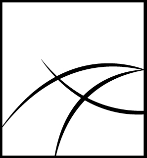

  
  &nbsp;&nbsp;
  

# GSoC 2025 Final Report

| **Organization** | Alaska |
|------------------|:-------|
| **Project Title** | Automated Coastline Extraction for Erosion Modeling in Alaska |
| **Mentors** | Frank Witmer, Rawan Elframawy |
| **Student** | Ritika Kumari |

---

## About Me  
- 📧 Email: rkjane333@gmail.com 
- 🔗 LinkedIn: www.linkedin.com/in/ritika-kumari-b15b95289

---

## About Alaska  
*Alaska supports geospatial research and tool development for better understanding and managing environmental change, with a focus on Arctic and sub-Arctic regions.*  

---

## Links to Repositories 
-CoastlineExtraction - https://github.com/fwitmer/CoastlineExtraction
-CoastLineExtration(My Fork) - https://github.com/Ritika-K7/CoastlineExtraction

---

## Project Overview – What I Did This Summer  

### 1. ⚙️ Configuration Management System  
I added two files to make the project easier to organize and maintain:  

- **`config_template.json`** – A single configuration file that stores all file paths and folder structures (satellite images, shapefiles, ground truth data, processed outputs, etc.) in one place.  
- **`load_config.py`** – A Python helper module with functions like `get_image_path()`, `get_shapefile_path()`, and `get_raw_data_path()` to quickly access files without hardcoding paths.  

This system avoids hardcoded file paths, so the project is not tied to one person’s computer setup. Anyone can run the code without needing to manually change paths for their system.  

---

### 2.Utilities Folder (`utils/`)  
I created a `utils/` folder with five reusable modules to support the coastline extraction workflow:  

| **Module** | **Description** |
|------------|-----------------|
| `check_crs.py` | Validates and compares CRS of raster/vector files to prevent mismatch errors. |
| `gis_tools.py` | Provides spatial analysis functions like `create_transect_points()` (transect–coastline intersections) and `clip_shp()` (shapefile clipping). |
| `rasterize_shapefile.py` | Converts vector coastline shapefiles to raster GeoTIFFs for binary masks used in training/analysis. |
| `shapefile_generator.py` | Creates shapefiles from raster data via morphological active contours, with noise reduction and contour extraction. |
| `spatial_analysis.py` | Offers spatial checks like `log_spatial_info()` to validate raster–point alignment and overlaps. |

These reusable utilities ensure consistency, enable format conversion, support spatial validation, and make the workflow modular and maintainable.  

---

### 3.Fixing the NDWI Labeling Script (`ndwi_labels.py`)  
I enhanced the NDWI labeling script by adding new functions, utility integrations, and automated workflows:  

#### Integration of Utility Modules  
- Imported custom utilities: `check_crs`, `crs_match`, `log_spatial_info`, and `save_concatenated_ndwi_with_shapefile`  
- Integrated the configuration system with `load_config` and path helper functions  

#### Data Validation and Error Prevention  
- Added CRS validation using `check_crs()`  
- Ensured coordinate system compatibility with `crs_match()`  
- Used `log_spatial_info()` to validate data alignment and overlap  

#### Robust Spatial Processing  
- Added intersection checking with `buffer.intersects(raster_bounds_geom)` to prevent processing points outside the raster bounds.  
- Added proper bounds handling by retrieving `raster_bounds` inside the raster context to ensure accurate processing.  
- Added `box` import from shapely for correct geometry operations and spatial consistency.  

#### Automated Output Generation  
- Integrated `save_concatenated_ndwi_with_shapefile()` to automatically save results and generate coastline shapefiles.  
- Created a separate `save_ndwi_plots()` function to export visualization outputs instead of only displaying them.  

---

# 4. Data Preprocessing Pipeline  

### **Step 1: Batch Alignment**  
**Purpose:** Align raw satellite images to a common CRS, pixel size, and extent.  
**Tool:** `GDAL warp` (`batch_align.py`)  
**Input:** 32 raw satellite GeoTIFFs from `raw_data/` + NDWI reference image  

**Process:**  
- Reads configuration and alignment parameters from the reference image  
- Sets alignment parameters:  
  - CRS: UTM Zone 3N (EPSG:32603)  
  - Pixel size: **3.125 m** (medium-resolution NDWI image)  
  - Spatial extent: `[598355.000000, 7326619.000000, 605849.500000, 7334628.500000]`  
- Uses GDAL warp to align CRS, resolution, and extent  

---

### **Step 2: Georeferencing**  
**Purpose:** Apply pixel-level precision correction for spatial alignment.  
**Tool:** `AROSICS` (`georeference.py`)  
**Input:** Aligned images from Step 1 + NDWI base image + Deering Airstrip coordinates  

**Process:**  
- Coregisters aligned images with AROSICS  
- Applies fine spatial corrections for pixel-level accuracy  
- Corrects rotated or tiled images as needed  

**Output:** 32 georeferenced GeoTIFFs (`*_GeoRegistered.tif`)  

---

### **Step 3: Mask Generation**  
**Purpose:** Create binary water/land masks with scientific validation.  
**Tool:** `create_masks.py`  
**Input:** Georeferenced images from Step 2 + transect points shapefile  

**Process:**  
- Computes NDWI from Green + NIR bands  
- Applies Gaussian blur for noise reduction  
- Performs sliding window analysis around transect points  
- Combines local classification with global NDWI threshold  

**Output:**  
- Binary mask TIFFs (`*_concatenated_ndwi.tif`)  
- Coastline shapefiles (`*_Coast_Contour.shp`)  
- Visualization plots (NDWI, mask, summary)

  

---

### **Step 4: Image Tiling**  
**Purpose:** Split images and masks into smaller tiles for training.  
**Tool:** `Rasterio` (`tile_images.py`)  
**Input:** Georeferenced images (Step 2) + Masks (Step 3)  

**Process:**  
- Reads raster data with georeferencing  
- Splits into **512×512** pixel tiles with overlap  
- Applies identical tiling to both images and masks  

**Output:** ~1,100 tiles (~550 images + ~550 masks)  

---

### **Step 5: Data Augmentation**  
**Purpose:** Expand dataset with rotated and flipped variations.  
**Tools:** `OpenCV + Rasterio` (`augment_tiles.py`)  
**Input:** Image–mask tile pairs from Step 4  

**Process:**  
- Reads each tile pair  
- Generates rotated & flipped variations (**7 augmentations**)  
- Preserves georeferencing metadata  

**Output:** ~8,800 tiles (1,100 original + 7,700 augmented)  

---

### **Training Dataset Statistics**  
- **Batch Alignment:** 32 images  
- **Georeferencing:** 32 images  
- **Mask Generation:** 5 selected georeferenced images → 5 binary masks  
- **Image Tiling:**  
  - 110 tiles per image × 5 images = 550 image tiles  
  - 110 tiles per mask × 5 masks = 550 mask tiles  
  - **Total = 1,100 image–mask tiles**  
- **Data Augmentation:**  
  - 1,100 original tiles × 8 versions (1 original + 7 augmented)  
  - **= 8,800 tiles (4,400 images + 4,400 masks)**  

📊 *Insert Diagram: Data Preprocessing Pipeline*  

---

# 5. Models  

## **5.1 UNet**  
**Description:**  
UNet is a convolutional neural network designed for semantic segmentation, widely used for extracting features such as coastlines from satellite images.  

**Dataset Formation:**  
Training data prepared using all preprocessing steps:  
1. Batch Alignment  
2. Georeferencing  
3. Mask Generation  
4. Image Tiling  
5. Data Augmentation  

📊 *Insert Diagram: UNet Training Pipeline*  

---

## **5.2 DeepWaterMap**  
**Description:**  
DeepWaterMap is a deep learning model specialized for **surface water mapping** using multispectral satellite imagery.  

**Dataset Formation:**  
- Uses preprocessing **Step 1 → Step 4** (Batch Alignment → Georeferencing → Mask Generation → Tiling)  
- Instead of separate image & mask files:  
  - Adds **Mask as 5th Band**  
  - Original 4 bands: R, G, B, NIR  
  - New stacked tile:  
    - Band 1 = Red  
    - Band 2 = Green  
    - Band 3 = Blue  
    - Band 4 = NIR  
    - Band 5 = Binary Water Mask (0 = land, 1 = water)  

📊 *Insert Screenshot: Visualization showing Band 5 added*  

**Data Format:**  
DeepWaterMap requires **TFRecord format** (not TIFF/PNG).  
Each TFRecord contains:  
- **Image tensor:** 5 stacked bands (normalized)  
- **Label tensor:** Water mask band (last channel)  

**Final Dataset Structure:**  
- `train_*.tfrecord` → Training data  
- `test_*.tfrecord` → Validation/Testing data
  

---
Contributions
| PR Link | Description | Status |
|---------|-------------|--------|
| [#42](https://github.com/fwitmer/CoastlineExtraction/pull/42) | Add config_template.json to guide users in setting up image and shape file paths | Merged |
| [#43](https://github.com/fwitmer/CoastlineExtraction/pull/43) | add CRS checker utility for raster and vector geospatial files | Merged |
| [#44](https://github.com/fwitmer/CoastlineExtraction/pull/44) | Integrate load_config for dynamic path handling in ndwi_labels.py and add missing raster file | Merged |
| [#45](https://github.com/fwitmer/CoastlineExtraction/pull/45) | Add CRS validation to ndwi_labels.py for input files. | Merged |
| [#46](https://github.com/fwitmer/CoastlineExtraction/pull/46) | Add spatial_analysis.py utility and integrate with ndwi_labels.py | Merged |
| [#47](https://github.com/fwitmer/CoastlineExtraction/pull/47) | Add intersection check to skip non-overlapping buffers in NDWI processing. | Merged |
| [#48](https://github.com/fwitmer/CoastlineExtraction/pull/48) | Refactor: Extract plotting logic into separate save_ndwi_plots() function | Merged |
| [#49](https://github.com/fwitmer/CoastlineExtraction/pull/49) | feat: integrate shapefile generation for coastline extraction | Merged |
| [#50](https://github.com/fwitmer/CoastlineExtraction/pull/50) | refactor: move GIS utility functions from ndwi_labels.py to utils/gis_tools.py | Merged |
| [#51](https://github.com/fwitmer/CoastlineExtraction/pull/51) | Add utility to rasterize coastline shapefile to GeoTIFF | Merged |
| [#52](https://github.com/fwitmer/CoastlineExtraction/pull/52) | feat : Add batch alignment script for satellite image preprocessing | Merged |
| [#53](https://github.com/fwitmer/CoastlineExtraction/pull/53) | feat: Add fine coregistration script for satellite image fine-tuning | Merged |
| [#54](https://github.com/fwitmer/CoastlineExtraction/pull/54) | feat: Add image tiling script for satellite image preprocessing | Merged |
| [#56](https://github.com/fwitmer/CoastlineExtraction/pull/56) | Enhance batch_align.py with improved resolution handling and documentation | Merged |
| [#57](https://github.com/fwitmer/CoastlineExtraction/pull/57) | Adds three key scripts for preprocessing satellite imagery data| Merged |
| [#58](https://github.com/fwitmer/CoastlineExtraction/pull/58) | Enhanced Data Preprocessing Pipeline with Water Mask Generation | Merged |
| [#59](https://github.com/fwitmer/CoastlineExtraction/pull/59) | Training, Prediction & Mask Band Integration for Coastline Segmentation | Merged |

